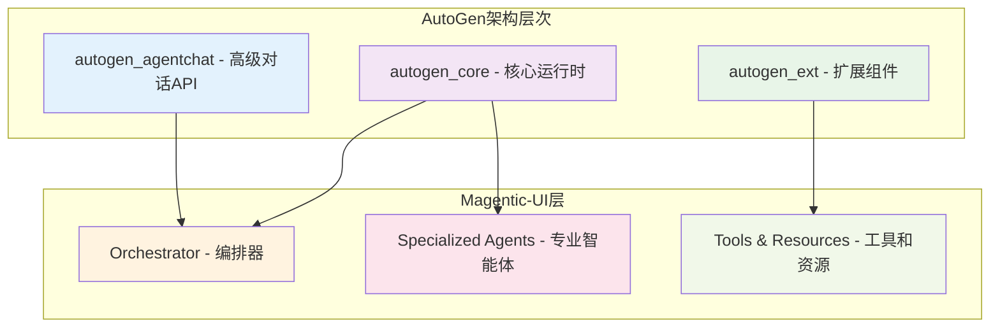
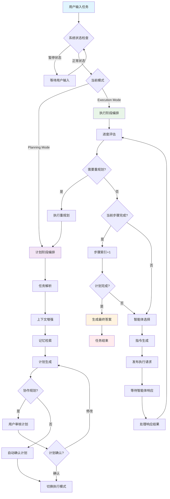
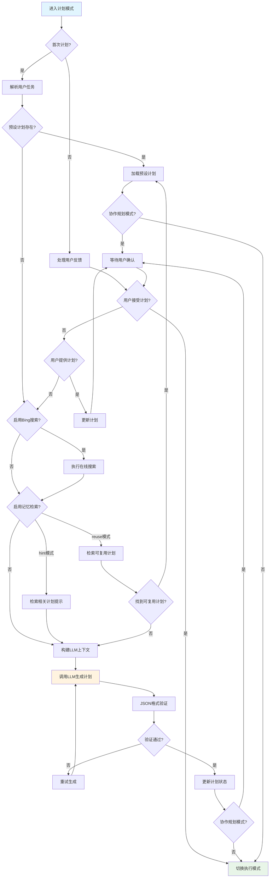
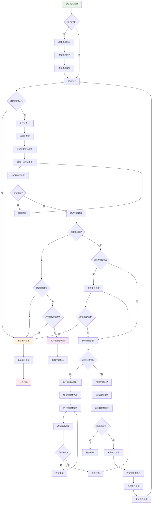
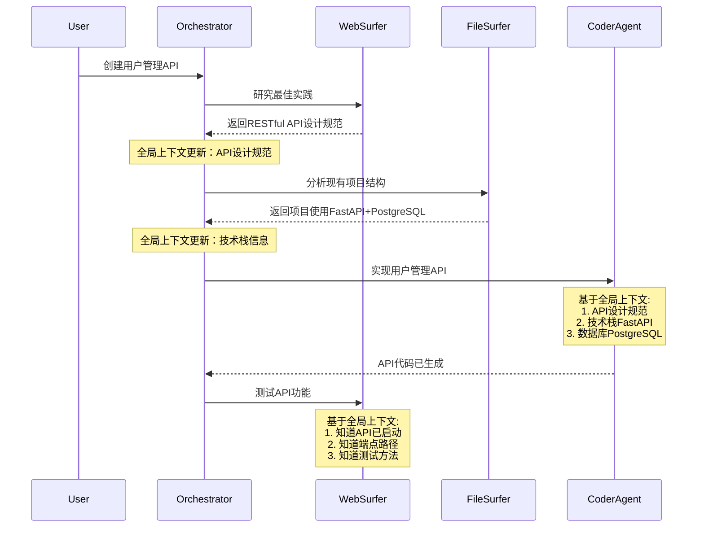
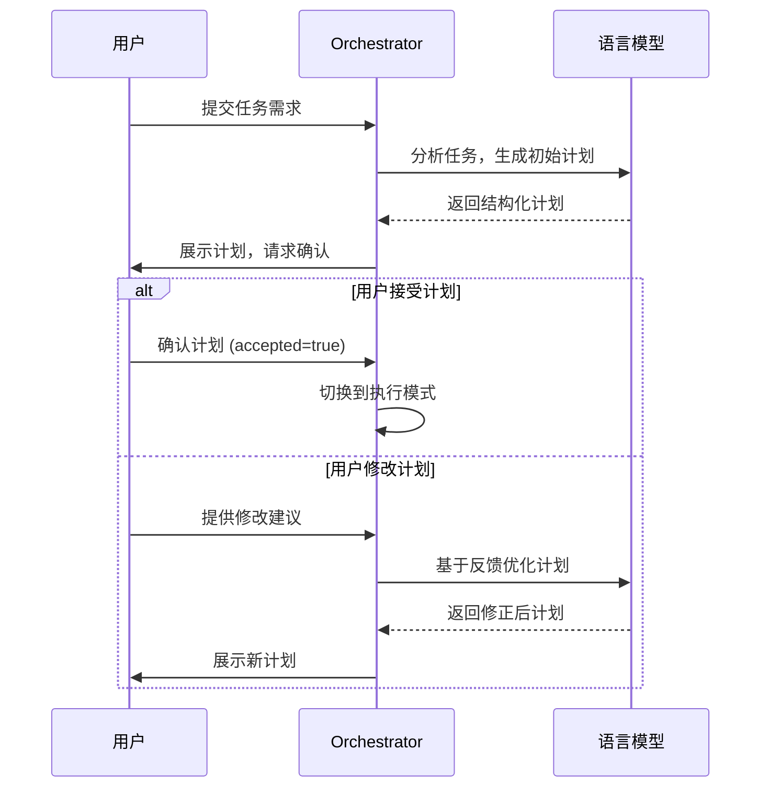

# Magentic-UI：多智能体编排架构技术分享

## 1. 项目概览

Magentic-UI 是 Microsoft Research 开发的一个人机协作式多智能体系统，专门用于网页自动化任务。该项目采用了先进的多智能体编排架构，通过协调不同职能的 AI 智能体来完成复杂任务。

### 核心特性
- **6 类专业智能体**：各司其职的专业化智能体协同工作
- **透明可控**：所有AI操作过程可见，用户可随时介入
- **人机协作**：智能体与人类用户高效协作
- **真实环境执行**：在真实浏览器和代码环境中操作

### 项目代码结构

为便于快速理解项目组织，以下是核心目录结构及其功能：

```
magentic-ui/
├── src/magentic_ui/                    # 核心Python包
│   ├── teams/                          # 团队编排模块
│   │   ├── orchestrator/               # 编排器实现
│   │   │   ├── _orchestrator.py       # 核心编排逻辑 (1464行)
│   │   │   ├── _prompts.py            # LLM提示模板 (1000+行)
│   │   │   ├── _group_chat.py         # 群聊管理
│   │   │   └── orchestrator_config.py # 编排器配置
│   │   └── roundrobin_orchestrator.py # 轮询编排器
│   │
│   ├── agents/                         # 智能体实现
│   │   ├── _coder.py                  # 代码执行智能体
│   │   ├── _user_proxy.py             # 用户代理智能体
│   │   ├── web_surfer/                # 网页浏览智能体
│   │   │   ├── _web_surfer.py        # 主要实现逻辑
│   │   │   ├── _prompts.py           # 网页操作提示
│   │   │   └── _tool_definitions.py  # 工具定义
│   │   ├── file_surfer/               # 文件操作智能体
│   │   │   └── _file_surfer.py       # 文件处理逻辑
│   │   ├── mcp/                       # MCP协议智能体
│   │   │   ├── _agent.py             # MCP智能体实现
│   │   │   └── _config.py            # MCP配置管理
│   │   └── users/                     # 用户代理变体
│   │       ├── _dummy_user_proxy.py  # 虚拟用户代理
│   │       └── _metadata_user_proxy.py # 元数据用户代理
│   │
│   ├── tools/                          # 工具和资源模块
│   │   ├── playwright/                # Playwright浏览器控制
│   │   │   ├── browser/               # 浏览器抽象层
│   │   │   ├── playwright_controller.py # 浏览器控制器
│   │   │   └── playwright_state.py    # 浏览器状态管理
│   │   ├── bing_search.py             # Bing搜索集成
│   │   └── mcp/                       # MCP工具集成
│   │       └── _aggregate_workbench.py # MCP工作台
│   │
│   ├── learning/                       # 学习和记忆模块
│   │   ├── learner.py                 # 学习器实现
│   │   └── memory_provider.py         # 记忆提供器
│   │
│   ├── backend/                        # 后端服务
│   │   ├── web/                       # Web API服务
│   │   │   ├── app.py                # FastAPI应用主体
│   │   │   ├── routes/               # API路由定义
│   │   │   └── managers/             # 连接管理器
│   │   ├── database/                  # 数据库管理
│   │   │   ├── db_manager.py         # 数据库操作
│   │   │   └── schema_manager.py     # 数据库架构
│   │   └── teammanager/              # 团队管理器
│   │       └── teammanager.py        # 团队生命周期管理
│   │
│   ├── task_team.py                   # 任务团队构建 (核心入口)
│   ├── magentic_ui_config.py         # 全局配置管理
│   ├── approval_guard.py             # 操作审批守卫
│   ├── guarded_action.py            # 受保护的动作
│   ├── utils.py                      # 通用工具函数
│   └── types.py                      # 类型定义
│
├── frontend/                          # React前端应用
│   ├── src/
│   │   ├── components/               # React组件
│   │   │   ├── views/               # 视图组件
│   │   │   │   ├── chat/           # 聊天界面组件
│   │   │   │   └── manager.tsx     # 主管理界面
│   │   │   └── settings/           # 设置界面组件
│   │   ├── hooks/                   # React Hooks
│   │   └── types/                   # TypeScript类型
│   └── package.json                 # 前端依赖配置
│
├── experiments/                       # 实验和评估
│   ├── eval/                         # 评估脚本
│   │   ├── systems/                 # 评估系统实现
│   │   └── run.py                   # 评估执行脚本
│   └── endpoint_configs/            # 端点配置
│
├── samples/                          # 示例代码
│   ├── sample_web_surfer.py         # WebSurfer使用示例
│   ├── sample_coder.py              # CoderAgent使用示例
│   └── sample_file_surfer.py        # FileSurfer使用示例
│
├── tests/                            # 测试代码
└── docs/                            # 文档和教程
    └── tutorials/                   # 教程文件
```

### 核心文件功能详解

| 文件/模块 | 代码行数 | 核心功能 | 技术关键点 |
|----------|---------|----------|-----------|
| **_orchestrator.py** | ~1464行 | 多智能体编排核心逻辑 | 二阶段编排、状态管理、上下文处理 |
| **_prompts.py** | ~1000+行 | LLM提示模板管理 | 计划生成、进度评估、JSON验证 |
| **task_team.py** | ~257行 | 任务团队构建入口 | 智能体组装、配置管理、依赖注入 |
| **_web_surfer.py** | ~1000+行 | 网页浏览和交互 | Playwright集成、DOM操作、截图分析 |
| **_coder.py** | ~600+行 | 代码生成和执行 | Docker集成、代码调试、错误处理 |
| **magentic_ui_config.py** | ~300+行 | 全局配置管理 | 模型配置、智能体参数、运行时设置 |

### 关键设计模式

#### 1. 分层架构模式
```python
# 清晰的分层结构
Frontend (React) 
    ↓ WebSocket/REST API
Backend (FastAPI)
    ↓ 函数调用
Teams (Orchestrator + Agents)
    ↓ 工具调用  
Tools (Playwright/Docker/MCP)
```

#### 2. 组件化设计
```python
# 每个智能体都是独立的组件
class WebSurfer(BaseChatAgent, Component[WebSurferConfig]):
    """可配置、可序列化的组件"""
    
class CoderAgent(BaseChatAgent, Component[CoderConfig]):
    """支持热插拔和动态配置"""
```

#### 3. 配置驱动架构
```python
# 通过配置文件管理复杂行为
@dataclass
class OrchestratorConfig:
    cooperative_planning: bool = True      # 协作规划开关
    autonomous_execution: bool = False     # 自主执行模式
    max_turns: Optional[int] = None        # 最大执行轮次
    sentinel_tasks: bool = False           # Sentinel任务支持
```

### 代码质量特征

#### 现代Python最佳实践
- **类型注解**：全面使用类型提示，增强代码可读性
- **异步编程**：大量使用async/await，支持高并发
- **数据类**：使用Pydantic进行数据验证和序列化
- **依赖注入**：通过配置实现松耦合设计

#### 工程化水平
- **模块化设计**：功能边界清晰，便于维护和测试
- **配置管理**：集中式配置，支持多环境部署
- **错误处理**：完善的异常处理和错误恢复机制
- **可观测性**：详细的日志记录和状态追踪

#### 扩展性设计
- **插件机制**：MCP协议支持，便于集成第三方工具
- **组件化**：智能体和工具都可以独立扩展
- **配置化**：通过配置文件控制系统行为
- **事件驱动**：基于事件的松耦合通信

这种清晰的代码组织结构体现了现代软件工程的最佳实践，为构建复杂的多智能体系统提供了优秀的架构参考。

## 2. 技术基础：AutoGen框架

在深入分析Magentic-UI的智能体编排架构之前，我们需要了解其技术基础——Microsoft的AutoGen框架。

### 2.1 AutoGen框架概述

AutoGen是Microsoft开发的开源多智能体对话框架，为构建复杂的AI智能体系统提供了强大的基础设施。

```python
# AutoGen核心组件导入示例
from autogen_core import (
    AgentId, Component, ComponentModel, AgentRuntime, CancellationToken
)
from autogen_agentchat.agents import BaseChatAgent
from autogen_agentchat.teams import BaseGroupChat  
from autogen_agentchat.messages import BaseChatMessage, TextMessage, MultiModalMessage
```

### 2.2 AutoGen核心架构

#### 分层架构设计



#### 核心组件详解

| 组件层 | 功能 | Magentic-UI中的应用 |
|--------|------|-------------------|
| **autogen_core** | 基础运行时、消息传递、Agent生命周期管理 | 提供Agent运行环境和通信基础设施 |
| **autogen_agentchat** | 对话抽象、团队协作、消息处理 | 实现智能体间的结构化对话和协作 |
| **autogen_ext** | 代码执行器、工具集成、外部服务 | 集成Playwright、Docker等执行工具 |

### 2.3 AutoGen的关键特性

#### 事件驱动架构

```python
# AutoGen事件驱动示例 (基于 _orchestrator.py)
from autogen_core import event, rpc, DefaultTopicId

class Orchestrator(BaseGroupChatManager):
    @rpc
    async def handle_start(self, message: GroupChatStart, ctx: MessageContext) -> None:
        """处理对话开始事件"""
        await self.publish_message(
            GroupChatStart(messages=message.messages),
            topic_id=DefaultTopicId(type=self._group_topic_type),
            cancellation_token=ctx.cancellation_token,
        )
    
    @event  
    async def handle_agent_response(self, message: GroupChatAgentResponse, ctx: MessageContext) -> None:
        """处理智能体响应事件"""
        self._state.message_history.append(message.agent_response.chat_message)
        await self._orchestrate_step(ctx.cancellation_token)
```

**事件类型和用途：**

| 事件类型 | 触发时机 | 处理逻辑 |
|----------|----------|----------|
| `GroupChatStart` | 多智能体对话开始 | 初始化对话状态，分发初始消息 |
| `GroupChatAgentResponse` | 智能体完成响应 | 更新消息历史，触发下一步编排 |
| `GroupChatRequestPublish` | 请求特定智能体响应 | 路由消息到目标智能体 |
| `GroupChatTermination` | 对话结束 | 清理资源，保存状态 |

#### 组件化设计

```python
# AutoGen组件化示例 (基于 task_team.py)
from autogen_core import Component, ComponentModel

class GroupChat(BaseGroupChat, Component[GroupChatConfig]):
    """
    GroupChat作为组件，支持序列化和配置管理
    """
    component_config_schema = GroupChatConfig
    component_provider_override = "magentic_ui.teams.GroupChat"

    def _to_config(self) -> GroupChatConfig:
        """将当前配置序列化为ComponentModel"""
        return GroupChatConfig(
            participants=[agent.dump_component() for agent in self._participants],
            model_client=self._model_client.dump_component(),
            orchestrator_config=self._orchestrator_config.model_dump(),
        )
    
    @classmethod
    def _from_config(cls, config: GroupChatConfig) -> "GroupChat":
        """从配置反序列化组件"""
        return cls(
            participants=[ChatAgent.load_component(agent) for agent in config.participants],
            model_client=ChatCompletionClient.load_component(config.model_client),
            orchestrator_config=OrchestratorConfig(**config.orchestrator_config),
        )
```

#### 异步并发模型

```python
# AutoGen异步处理模式
class BaseChatAgent:
    async def on_messages_stream(
        self, messages: Sequence[BaseChatMessage], cancellation_token: CancellationToken
    ) -> AsyncGenerator[BaseAgentEvent | BaseChatMessage | Response, None]:
        """流式处理消息，支持异步并发"""
        # 智能体可以同时处理多个消息流
        async for response in self._process_messages_async(messages):
            yield response
            # 支持中途取消和暂停
            if cancellation_token.is_cancelled():
                return
```

### 2.4 Magentic-UI对AutoGen的扩展

#### 专业化智能体扩展

Magentic-UI在AutoGen基础上实现了专业化的智能体类型：

```python
# 专业化智能体继承结构
class BaseChatAgent(autogen_agentchat.agents.BaseChatAgent):
    """AutoGen提供的基础智能体类"""
    pass

class WebSurfer(BaseChatAgent):
    """Magentic-UI扩展：网页浏览智能体"""
    def __init__(self, browser: PlaywrightBrowser, ...):
        self._browser = browser  # 集成Playwright浏览器
        super().__init__(...)

class CoderAgent(BaseChatAgent):  
    """Magentic-UI扩展：代码执行智能体"""
    def __init__(self, code_executor: CodeExecutor, ...):
        self._code_executor = code_executor  # 集成Docker代码执行器
        super().__init__(...)
```

#### 编排模式创新

```python
# Magentic-UI创新的二阶段编排模式
class Orchestrator(BaseGroupChatManager):
    """扩展AutoGen的BaseGroupChatManager，实现二阶段编排"""
    
    def __init__(self, config: OrchestratorConfig, ...):
        super().__init__(...)
        self._state = OrchestratorState()  # Magentic-UI特有的状态管理
        
    async def _orchestrate_step(self, cancellation_token: CancellationToken):
        """Magentic-UI核心创新：计划-执行二阶段编排"""
        if self._state.in_planning_mode:
            await self._orchestrate_step_planning(cancellation_token)  # 计划阶段
        else:
            await self._orchestrate_step_execution(cancellation_token)  # 执行阶段
```

#### 上下文管理增强

```python
# Magentic-UI增强的上下文管理
from autogen_core.model_context import TokenLimitedChatCompletionContext

class Orchestrator:
    def __init__(self, ...):
        # 使用AutoGen的Token限制上下文管理器
        self._model_context = TokenLimitedChatCompletionContext(
            model_client, 
            token_limit=config.model_context_token_limit
        )
        
    def _thread_to_context(self, messages: List[BaseChatMessage]) -> List[LLMMessage]:
        """Magentic-UI扩展：智能上下文转换和优化"""
        # 利用AutoGen的消息抽象，添加多模态和计划解析支持
        return thread_to_context(messages, self._name, is_multimodal=True)
```

### 2.5 AutoGen vs 其他多智能体框架对比

| 特性 | AutoGen | LangChain Agents | CrewAI | Magentic-UI选择理由 |
|------|---------|------------------|---------|-------------------|
| **架构设计** | 分层模块化 | 链式调用 | 角色导向 | 支持复杂编排逻辑 |
| **异步支持** | 原生异步 | 部分支持 | 有限支持 | 高并发任务处理需求 |
| **状态管理** | 内置状态机 | 外部存储 | 简单状态 | 复杂任务状态追踪 |
| **扩展性** | 组件化设计 | 插件机制 | 模板化 | 便于定制专业智能体 |
| **消息传递** | 事件驱动 | 函数调用 | 直接通信 | 支持复杂通信模式 |

### 2.6 AutoGen在Magentic-UI中的价值

#### 技术价值

1. **稳定的运行时基础**：提供可靠的智能体生命周期管理
2. **事件驱动通信**：支持复杂的智能体间协作模式  
3. **组件化架构**：便于系统扩展和维护
4. **异步并发模型**：满足实时性和并发性要求
5. **丰富的工具生态**：集成代码执行、模型调用等基础设施

#### 工程价值

1. **降低开发复杂度**：专注于业务逻辑而非基础设施
2. **提升系统稳定性**：基于经过验证的框架构建
3. **便于团队协作**：标准化的开发模式和接口
4. **持续演进能力**：跟随AutoGen生态发展获得新特性

通过深度集成AutoGen框架，Magentic-UI在坚实的技术基础上实现了创新的多智能体编排模式，为复杂任务的自动化执行提供了强大而灵活的解决方案。

### 2.7 核心编排算法实现

AutoGen框架为Magentic-UI提供了强大的编排基础，核心编排逻辑体现了框架的优势：

```python
# 主编排逻辑 (_orchestrator.py:559-570)
async def _orchestrate_step(self, cancellation_token: CancellationToken) -> None:
    """AutoGen事件驱动的编排核心逻辑"""
    if self._state.is_paused:
        # 利用AutoGen的消息路由机制，暂停时转交用户
        await self._request_next_speaker(self._user_agent_topic, cancellation_token)
        return

    # AutoGen支持的状态机模式：计划模式和执行模式
    if self._state.in_planning_mode:
        await self._orchestrate_step_planning(cancellation_token)  # 计划阶段编排
    else:
        await self._orchestrate_step_execution(cancellation_token)  # 执行阶段编排
```

### 2.8 智能体间通信机制

AutoGen Core的事件驱动通信架构是Magentic-UI智能体协作的技术基础：

#### 消息驱动架构

```python
# AutoGen消息发布机制 (_orchestrator.py:405-409)
await self.publish_message(
    GroupChatAgentResponse(agent_response=Response(chat_message=message)),
    topic_id=DefaultTopicId(type=self._group_topic_type),  # AutoGen topic路由
    cancellation_token=cancellation_token,  # AutoGen取消令牌机制
)
```

#### 核心消息类型（基于AutoGen）

| AutoGen消息类型 | 用途 | 触发时机 | 代码位置 |
|----------------|------|----------|----------|
| `GroupChatStart` | 启动多智能体会话 | 任务开始 | `_group_chat.py:121` |
| `GroupChatMessage` | 智能体间消息传递 | 执行过程 | AutoGen Core |
| `GroupChatRequestPublish` | 请求特定智能体响应 | 智能体选择 | `_orchestrator.py:1045` |
| `GroupChatAgentResponse` | 智能体响应结果 | 完成子任务 | `_orchestrator.py:405` |
| `GroupChatTermination` | 终止会话 | 任务完成/异常 | `_group_chat.py:128` |

#### 智能体选择策略

```python
# 基于AutoGen的智能体路由逻辑 (_orchestrator.py:1045-1057)
valid_next_speaker: bool = False
next_speaker = progress_ledger["instruction_or_question"]["agent_name"]

# AutoGen框架的参与者管理机制
for participant_name in self._agent_execution_names:
    if participant_name == next_speaker:
        # 使用AutoGen的消息路由API
        await self._request_next_speaker(next_speaker, cancellation_token)
        valid_next_speaker = True
        break
```

智能体选择策略基于AutoGen的能力：
- **任务特征分析**：通过LLM分析当前步骤需要的智能体能力 (`_orchestrator.py:949-970`)
- **智能体能力匹配**：匹配最适合的智能体类型 (`task_team.py:240-248`)
- **上下文感知**：利用AutoGen的消息历史机制考虑执行上下文 (`utils.py:122-169`)

## 3. 智能体架构设计

### 3.1 智能体类型

项目定义了 6 种核心智能体类型：

```python
# 智能体类型定义 (task_team.py:240-248)
team_participants: List[ChatAgent] = [
    web_surfer,        # 网页操作智能体
    user_proxy,        # 用户代理智能体  
    coder_agent,       # 代码生成智能体
    file_surfer,       # 文件操作智能体
    *mcp_agents        # MCP协议扩展智能体
]
```

#### 各智能体职责分工：

| 智能体 | 职责 | 实现位置 |
|---------|------|----------|
| **Orchestrator** | 总协调者，负责计划制定和执行编排 | `_orchestrator.py:113` |
| **WebSurfer** | 网页浏览和操作，使用 Playwright 控制浏览器 | `web_surfer/_web_surfer.py` |
| **CoderAgent** | 代码生成、执行和调试 | `_coder.py` |
| **FileSurfer** | 文件系统操作和文档处理 | `file_surfer/_file_surfer.py` |
| **UserProxy** | 用户交互代理，处理人机协作 | `users/` |
| **McpAgent** | MCP协议扩展，支持自定义工具集成 | `mcp/_agent.py` |

### 2.2 智能体配置体系

```python
# 智能体配置核心逻辑 (task_team.py:64-130)
model_client_orch = get_model_client(magentic_ui_config.model_client_configs.orchestrator)
websurfer_config = WebSurferConfig(
    name="web_surfer",
    model_client=websurfer_model_client,
    browser=browser_resource_config,
    max_actions_per_step=magentic_ui_config.max_actions_per_step,
    # ... 更多配置
)
```

每个智能体都有独立的模型客户端配置，支持：
- **OpenAI GPT-4o/GPT-4-turbo** 系列
- **Azure OpenAI** 企业版
- **Ollama** 本地部署
- **自定义模型** 兼容接口

## 3. 编排核心：Orchestrator 架构

### 3.1 Orchestrator 状态管理

```python
# 编排器状态定义 (_orchestrator.py:70-87)
class OrchestratorState(BaseGroupChatManagerState):
    task: str = ""                    # 当前任务
    plan_str: str = ""               # 计划字符串表示
    plan: Plan | None = None         # 结构化计划对象
    n_rounds: int = 0                # 执行轮次
    current_step_idx: int = 0        # 当前步骤索引
    information_collected: str = ""   # 收集的信息
    in_planning_mode: bool = True    # 是否处于计划模式
    is_paused: bool = False          # 是否暂停
    message_history: List[BaseChatMessage | BaseAgentEvent] = []
```

### 3.2 双模式编排机制

Orchestrator 采用**二阶段编排模式**：

#### Phase 1: Planning Mode（计划阶段）
```python
# 计划模式编排 (_orchestrator.py:690)
async def _orchestrate_step_planning(self, cancellation_token: CancellationToken) -> None:
    # 1. 解析用户输入任务
    # 2. 生成初始执行计划
    # 3. 支持协作式计划优化
    # 4. 计划确认后切换到执行模式
```

**计划生成流程：**
1. **任务解析**：提取用户输入的核心任务
2. **上下文搜索**：可选的 Bing 搜索增强上下文
3. **记忆检索**：从历史计划中检索相关经验
4. **计划生成**：使用 LLM 生成结构化计划
5. **协作优化**：用户可参与计划修正

#### Phase 2: Execution Mode（执行阶段）
```python
# 执行模式编排 (_orchestrator.py:918)
async def _orchestrate_step_execution(self, cancellation_token: CancellationToken, first_step: bool = False) -> None:
    # 1. 分析当前执行进度
    # 2. 选择最合适的智能体
    # 3. 生成具体执行指令
    # 4. 监控执行结果
    # 5. 支持动态重新规划
```

**执行编排流程：**
1. **进度评估**：分析当前步骤完成情况
2. **智能体选择**：基于任务特征选择最适合的智能体
3. **指令生成**：为目标智能体生成具体指令
4. **执行监控**：实时跟踪执行状态
5. **异常处理**：支持重新规划和错误恢复

### 3.3 任务执行流程图

#### 总体编排流程



#### 计划阶段详细流程



#### 执行阶段详细流程



### 3.4 节点上下文详细分析

#### 计划阶段关键节点上下文

| 节点 | 输入上下文 | 处理逻辑 | 输出上下文 |
|------|-----------|----------|-----------|
| **任务解析** | `last_user_message.content` | 提取任务核心内容，转换为HumanInputFormat | `self._state.task = "TASK: " + content` |
| **上下文增强** | 当前任务字符串 | 可选Bing搜索增强任务理解 | 增强后的搜索结果添加到context |
| **记忆检索** | `self._state.task` | 从记忆控制器检索相关计划 | hint模式：添加到context；reuse模式：直接复用计划 |
| **计划生成** | LLM上下文 + 系统提示 | 调用LLM生成JSON格式计划 | 结构化Plan对象 |
| **协作规划** | 生成的计划 + 用户反馈 | 用户审核和修正计划 | 确认后的最终计划 |

```python
# 计划阶段上下文构建示例 (_orchestrator.py:776-801)
context = self._thread_to_context()  # 基础消息历史

# 1. 上下文增强 - Bing搜索
if self._config.do_bing_search:
    bing_search_results = await self.do_bing_search(last_user_message.content)
    if bing_search_results is not None:
        context.append(UserMessage(content=bing_search_results, source="web_surfer"))

# 2. 记忆检索 - 相关计划提示
if self._config.retrieve_relevant_plans == "hint":
    await self._handle_relevant_plan_from_memory(context=context)

# 3. 计划生成提示
context.append(UserMessage(
    content=self._get_task_ledger_plan_prompt(self._team_description),
    source=self._name
))

# 4. LLM调用生成计划
plan_response = await self._get_json_response(context, self._validate_plan_json, cancellation_token)
```

#### 执行阶段关键节点上下文

| 节点 | 输入上下文 | 处理逻辑 | 输出上下文 |
|------|-----------|----------|-----------|
| **进度评估** | 当前消息历史 + 计划状态 | LLM分析执行进度和完成情况 | 进度账本JSON：完成状态、重规划需求、下一步指令 |
| **智能体选择** | 进度账本结果 | 基于任务特征选择最适合的智能体 | 目标智能体名称 |
| **指令生成** | 当前步骤信息 + 智能体能力 | 为特定智能体生成具体执行指令 | 格式化的智能体指令 |
| **执行监控** | 智能体响应消息 | 解析执行结果，更新状态 | 更新后的消息历史和状态 |
| **重规划触发** | 执行失败信息 | 判断是否需要重新制定计划 | 重规划原因和新计划 |

```python
# 执行阶段上下文构建示例 (_orchestrator.py:949-970)
context = self._thread_to_context()  # 当前消息历史

# 1. 进度账本提示生成
progress_ledger_prompt = self._get_progress_ledger_prompt(
    self._state.task,           # 原始任务
    self._state.plan_str,       # 计划字符串
    self._state.current_step_idx,  # 当前步骤索引
    self._team_description,     # 智能体团队描述
    self._agent_execution_names,   # 可用智能体列表
)

context.append(UserMessage(content=progress_ledger_prompt, source=self._name))

# 2. LLM评估进度
progress_ledger = await self._get_json_response(context, self._validate_ledger_json, cancellation_token)

# 3. 解析结果
need_to_replan = progress_ledger["need_to_replan"]["answer"]
is_step_complete = progress_ledger["is_current_step_complete"]["answer"]
next_instruction = progress_ledger["instruction_or_question"]["answer"]
target_agent = progress_ledger["instruction_or_question"]["agent_name"]
```

### 3.5 上下文数据流转

#### 消息历史管理

```python
# 消息历史结构 (_orchestrator.py:84)
message_history: List[BaseChatMessage | BaseAgentEvent] = []

# 消息类型和用途
class MessageTypes:
    TextMessage: str        # 文本消息，承载指令和响应
    MultiModalMessage: Any  # 多模态消息，包含图像等
    BaseAgentEvent: Any     # 智能体事件，状态变更通知
```

#### 上下文转换机制

```python
# 上下文转换函数 (_orchestrator.py:1203-1238)
def _thread_to_context(self, messages: Optional[List[BaseChatMessage | BaseAgentEvent]] = None) -> List[LLMMessage]:
    """将消息线程转换为LLM上下文"""
    chat_messages = messages if messages is not None else self._state.message_history
    context_messages: List[LLMMessage] = []
    
    # 1. 系统消息 - 根据当前模式选择
    if self._state.in_planning_mode:
        context_messages.append(SystemMessage(content=self._get_system_message_planning()))
    else:
        context_messages.append(SystemMessage(content=ORCHESTRATOR_SYSTEM_MESSAGE_EXECUTION.format(date_today=date_today)))
    
    # 2. 消息历史转换 - 支持多模态
    if self._model_client.model_info["vision"]:
        context_messages.extend(thread_to_context(messages=chat_messages, agent_name=self._name, is_multimodal=True))
    else:
        context_messages.extend(thread_to_context(messages=chat_messages, agent_name=self._name, is_multimodal=False))
    
    return context_messages
```

### 3.6 状态上下文详解

#### 核心状态变量

```python
# 状态上下文详细结构
class OrchestratorState:
    # === 任务上下文 ===
    task: str                    # 原始任务描述，格式："TASK: [用户输入]"
    plan: Plan | None           # 结构化计划对象，包含步骤列表
    plan_str: str              # 计划的字符串表示，用于LLM理解
    
    # === 执行上下文 ===
    n_rounds: int              # 执行轮次，用于防止无限循环
    current_step_idx: int      # 当前执行的步骤索引，从0开始
    information_collected: str # 累积的执行信息，用于最终答案生成
    
    # === 控制上下文 ===
    in_planning_mode: bool     # 模式标识：True=计划模式，False=执行模式
    is_paused: bool           # 暂停状态，True时等待用户输入
    n_replans: int            # 重规划次数，用于限制重规划频率
    
    # === 通信上下文 ===
    message_history: List[BaseChatMessage | BaseAgentEvent]  # 完整消息历史
```

#### 状态转换时机

| 转换触发 | 状态变更 | 上下文影响 |
|---------|---------|-----------|
| **计划确认** | `in_planning_mode: False` | 切换到执行模式，清理历史消息 |
| **步骤完成** | `current_step_idx += 1` | 推进到下一步骤 |
| **重规划** | `in_planning_mode: True` | 回到计划模式，保留已完成步骤 |
| **任务暂停** | `is_paused: True` | 暂停自动执行，等待用户介入 |
| **任务完成** | 状态重置 | 保留消息历史，重置执行状态 |

### 3.7 特殊上下文处理

#### Sentinel步骤上下文

```python
# Sentinel步骤执行上下文 (_orchestrator.py:1285-1464)
async def _execute_sentinel_step(self, step: "SentinelPlanStep", cancellation_token: CancellationToken) -> None:
    # 1. 保存智能体初始状态
    initial_agent_state = None
    if can_save_load:
        initial_agent_state = await agent.save_state()
    
    while True:  # 循环执行直到条件满足
        # 2. 恢复智能体状态（确保每次执行的一致性）
        if can_save_load and initial_agent_state is not None:
            await agent.load_state(initial_agent_state, load_browser=False)
        
        # 3. 构建任务消息上下文
        sentinel_task_agent_message = [TextMessage(content=step_details, source="user")]
        
        # 4. 流式执行并收集响应
        async for response in agent.on_messages_stream(sentinel_task_agent_message, cancellation_token):
            # 处理响应，更新上下文...
        
        # 5. 条件检查上下文构建
        if isinstance(step.condition, str):  # 字符串条件需要LLM判断
            context: List[LLMMessage] = []
            context.append(UserMessage(content=last_agent_message.content, source=agent_name))
            
            condition_check_message = UserMessage(
                content=ORCHESTRATOR_SENTINEL_CONDITION_CHECK_PROMPT.format(
                    step_description=f"Step Title {step.title}, Step Instruction {step.details}, Step Condition {step.condition}, Agent Name {agent_name}",
                    condition=step.condition,
                ),
                source=self._name,
            )
            context.append(condition_check_message)
```

#### 网页上下文获取

```python
# 网页浏览器上下文获取 (_orchestrator.py:596-652)
async def _get_websurfer_page_info(self) -> None:
    """获取网页浏览器的页面信息上下文"""
    if self._web_agent_topic in self._participant_names:
        web_surfer = web_surfer_container._agent
        
        # 1. 获取页面基础信息
        page_title, page_url = await web_surfer.get_page_title_url()
        
        # 2. 获取标签页信息
        num_tabs, tabs_information_str = await web_surfer.get_tabs_info()
        
        # 3. 获取页面截图和描述
        if "about:blank" not in page_url:
            page_description, screenshot, metadata_hash = await web_surfer.describe_current_page()
            
            # 4. 构建多模态消息上下文
            if metadata_hash != self._last_browser_metadata_hash:
                message = MultiModalMessage(
                    content=[
                        tabs_information_str,
                        "A description of the current page: " + page_description,
                        AGImage.from_pil(PIL.Image.open(io.BytesIO(screenshot)))
                    ],
                    source="web_surfer",
                )
                self._state.message_history.append(message)  # 添加到上下文
```

### 3.8 运行时上下文详细机制

#### 核心提示模板深度解析

系统使用两个关键提示模板来构建运行时上下文：

##### 1. 计划生成提示模板 (`_get_task_ledger_plan_prompt`)

```python
# 计划阶段提示构建 (_orchestrator.py:258-260)
def _get_task_ledger_plan_prompt(self, team: str) -> str:
    return get_orchestrator_plan_prompt_json(self._config.sentinel_tasks).format(
        team=team, 
        additional_instructions=additional_instructions
    )

# 基础计划提示模板结构 (_prompts.py:694-705)
base_prompt = """
You have access to the following team members that can help you address the request each with unique expertise:

{team}

Remember, there is no requirement to involve all team members -- a team member's particular expertise may not be needed for this task.

{additional_instructions}
When you answer without a plan and your answer includes factual information, make sure to say whether the answer was found using online search or from your own internal knowledge.

Your plan should should be a sequence of steps that will complete the task.
"""
```

**实际运行时上下文示例：**

```json
{
  "系统提示": "You are a helpful AI assistant named Magentic-UI...",
  "团队描述": "web_surfer: Can browse websites and interact with web elements\ncoder_agent: Can execute Python code and file operations\nfile_surfer: Can read, analyze and process files\nuser_proxy: Represents the user in conversations",
  "附加指令": "Only use the following websites if possible: google.com, github.com, stackoverflow.com",
  "用户任务": "帮我分析GitHub上magentic-ui项目的star数量趋势",
  "历史计划提示": "Relevant plan:\n Previous successful plan for GitHub analysis...",
  "搜索上下文": "Bing search results: GitHub repository statistics show..."
}
```

##### 2. 进度评估提示模板 (`_get_progress_ledger_prompt`)

```python
# 进度评估提示构建 (_orchestrator.py:284-312)
def _get_progress_ledger_prompt(self, task: str, plan: str, step_index: int, team: str, names: List[str]) -> str:
    return get_orchestrator_progress_ledger_prompt(self._config.sentinel_tasks).format(
        task=task,
        plan=plan,
        step_index=step_index,
        step_title=self._state.plan[step_index].title,
        step_details=self._state.plan[step_index].details,
        step_type="PlanStep" if not isinstance(self._state.plan[step_index], SentinelPlanStep) else "SentinelPlanStep",
        agent_name=self._state.plan[step_index].agent_name,
        team=team,
        names=", ".join(names),
        additional_instructions=additional_instructions,
    )

# 进度评估基础模板 (_prompts.py:907-960)
base_prompt = """
Recall we are working on the following request:
{task}

This is our current plan:
{plan}

We are at step index {step_index} in the plan which is 
Title: {step_title}
Details: {step_details}
agent_name: {agent_name}

And we have assembled the following team:
{team}

To make progress on the request, please answer the following questions:
- is_current_step_complete: Is the current step complete?
- need_to_replan: Do we need to create a new plan?
- instruction_or_question: Provide complete instructions to accomplish the current step
- agent_name: Decide which team member should complete the current step
- progress_summary: Summarize all information gathered so far
"""
```

**实际运行时上下文示例：**

```json
{
  "原始任务": "帮我分析GitHub上magentic-ui项目的star数量趋势",
  "当前计划": "Step 1: 访问GitHub仓库页面\nStep 2: 获取star数量\nStep 3: 分析趋势数据",
  "当前步骤": {
    "索引": 1,
    "标题": "访问GitHub仓库页面",
    "详情": "导航到magentic-ui GitHub仓库，获取当前的star数量和基础信息",
    "负责智能体": "web_surfer"
  },
  "执行历史": [
    {"agent": "web_surfer", "action": "navigate", "result": "成功访问GitHub页面"},
    {"agent": "web_surfer", "action": "extract_data", "result": "当前star数量: 1,234"}
  ],
  "进度信息": "已成功访问GitHub仓库，获取到当前star数量1,234个"
}
```

#### 上下文共享与独享机制

##### 共享上下文（全局状态）

```python
# 全局共享状态 (_orchestrator.py:70-87)
class OrchestratorState:
    # === 共享上下文 ===
    task: str                    # 所有智能体共享的任务描述
    plan: Plan | None           # 全局执行计划，所有智能体可见
    message_history: List[BaseChatMessage | BaseAgentEvent]  # 全局消息历史
    information_collected: str   # 累积的信息，跨智能体共享
    
    # === 执行控制状态 ===
    current_step_idx: int       # 当前步骤索引，控制执行流程
    n_rounds: int              # 执行轮次计数器
    in_planning_mode: bool     # 模式状态标识
```

**共享上下文实际使用示例：**

```python
# 上下文在智能体间的共享 (_orchestrator.py:1018-1043)
new_instruction = self.get_agent_instruction(
    progress_ledger["instruction_or_question"]["answer"],  # 来自全局进度评估
    progress_ledger["instruction_or_question"]["agent_name"] # 目标智能体
)

# 格式化指令包含全局上下文
instruction_with_context = INSTRUCTION_AGENT_FORMAT.format(
    step_index=self._state.current_step_idx + 1,        # 全局步骤索引
    step_title=self._state.plan[self._state.current_step_idx].title,  # 当前计划步骤
    step_details=self._state.plan[self._state.current_step_idx].details,
    agent_name=target_agent_name,
    instruction=specific_instruction
)
```

##### 独享上下文（智能体私有状态）

```python
# 智能体私有状态管理
class WebSurferPrivateContext:
    browser_session: PlaywrightBrowser     # 浏览器会话状态
    current_page_url: str                  # 当前页面URL
    page_screenshot: bytes                 # 页面截图
    tabs_info: Dict[str, Any]             # 标签页信息
    
class CoderAgentPrivateContext:
    execution_environment: DockerContainer # 代码执行环境
    working_directory: str                 # 工作目录
    installed_packages: List[str]          # 已安装包列表
    code_history: List[str]               # 代码执行历史

# 私有上下文不跨智能体共享，保持隔离
```

#### 上下文构建的详细流程

##### Token限制下的上下文管理

```python
# 智能上下文截断 (_orchestrator.py:156-158)
self._model_context = TokenLimitedChatCompletionContext(
    model_client, 
    token_limit=config.model_context_token_limit  # 通常为8192或16384
)

# 上下文添加和截断
async def _get_json_response(self, messages: List[LLMMessage], ...) -> Dict[str, Any]:
    await self._model_context.clear()  # 清空上下文
    for msg in messages:
        await self._model_context.add_message(msg)  # 逐条添加消息
    
    # 智能截断，保留最重要的上下文
    token_limited_messages = await self._model_context.get_messages()
```

##### 多模态上下文处理

```python
# 多模态上下文构建 (_orchestrator.py:596-652)
async def _get_websurfer_page_info(self) -> None:
    # 获取网页浏览器上下文
    page_title, page_url = await web_surfer.get_page_title_url()
    page_description, screenshot, metadata_hash = await web_surfer.describe_current_page()
    
    # 构建多模态消息
    if metadata_hash != self._last_browser_metadata_hash:
        message = MultiModalMessage(
            content=[
                f"There are {num_tabs} tabs open. The tabs are as follows:\n{tabs_information_str}",
                "A description of the current page: " + page_description,
                AGImage.from_pil(PIL.Image.open(io.BytesIO(screenshot)))  # 图像上下文
            ],
            source="web_surfer",
        )
        self._state.message_history.append(message)  # 添加到共享上下文
```

#### 实际运行示例

##### 完整的任务执行上下文追踪

假设任务："分析GitHub上magentic-ui项目的issues趋势"

**Step 1: 计划阶段上下文构建**

```json
{
  "phase": "planning",
  "context_components": {
    "system_message": "You are a helpful AI assistant named Magentic-UI...",
    "team_description": "web_surfer: 可以浏览网页和提取数据\ncoder_agent: 可以执行Python代码进行数据分析\nfile_surfer: 可以处理文件操作",
    "user_input": "分析GitHub上magentic-ui项目的issues趋势",
    "search_enhancement": "Bing搜索结果: GitHub API documentation, issue analysis tools...",
    "memory_hint": "相关历史计划: 之前成功分析过其他GitHub项目的issues..."
  },
  "generated_plan": {
    "task": "分析GitHub上magentic-ui项目的issues趋势",
    "steps": [
      {"title": "访问GitHub仓库", "agent": "web_surfer", "details": "导航到magentic-ui仓库获取issues信息"},
      {"title": "提取issues数据", "agent": "web_surfer", "details": "收集最近的issues数据"},
      {"title": "数据分析", "agent": "coder_agent", "details": "使用Python分析issues趋势"}
    ]
  }
}
```

**Step 2: 执行阶段上下文构建**

```json
{
  "phase": "execution",
  "step_index": 0,
  "context_components": {
    "task_ledger": "我们正在处理: 分析GitHub上magentic-ui项目的issues趋势\n计划: Step 1: 访问GitHub仓库...",
    "current_step": {
      "title": "访问GitHub仓库",
      "details": "导航到magentic-ui仓库获取issues信息",
      "agent": "web_surfer"
    },
    "execution_history": [
      {"round": 1, "agent": "web_surfer", "status": "in_progress"}
    ],
    "progress_evaluation": {
      "is_current_step_complete": {"answer": false, "reason": "web_surfer正在导航到GitHub页面"},
      "need_to_replan": {"answer": false, "reason": "当前计划可行，继续执行"},
      "instruction_or_question": {
        "answer": "请导航到https://github.com/microsoft/magentic-ui，点击Issues标签，收集最近30天的issues数据",
        "agent_name": "web_surfer"
      },
      "progress_summary": "任务开始，准备访问GitHub仓库页面"
    }
  }
}
```

**Step 3: 智能体响应后的上下文更新**

```json
{
  "context_update": {
    "new_messages": [
      {
        "source": "web_surfer",
        "type": "MultiModalMessage",
        "content": [
          "成功访问GitHub仓库，当前在Issues页面",
          "页面描述: magentic-ui项目有234个open issues, 156个closed issues",
          "页面截图: [binary_image_data]"
        ]
      }
    ],
    "state_changes": {
      "current_step_idx": 1,  # 推进到下一步
      "information_collected": "成功访问GitHub仓库，发现234个open issues"
    },
    "shared_context_update": "全局消息历史更新，所有后续智能体都可以看到这个结果"
  }
}
```

### 3.9 Subagent中的全局消息历史使用

#### 全局消息历史的传递机制

全局消息历史通过 `thread_to_context` 函数在各个子智能体间传递和使用：

```python
# 消息历史转换函数 (utils.py:122-169)
def thread_to_context(
    messages: List[BaseAgentEvent | BaseChatMessage],
    agent_name: str,
    is_multimodal: bool = False,
) -> List[LLMMessage]:
    """将消息线程转换为LLM上下文，每个智能体都使用这个函数处理全局消息历史"""
    context: List[LLMMessage] = []
    for m in messages:
        if m.source == agent_name:
            # 自己发送的消息转为AssistantMessage
            context.append(AssistantMessage(content=m.content, source=m.source))
        elif m.source == "user_proxy" or m.source == "user":
            # 用户消息转为UserMessage，支持计划解析
            context.append(UserMessage(content=content, source=m.source))
        else:
            # 其他智能体的消息也转为UserMessage
            context.append(UserMessage(content=m.content, source=m.source))
    return context
```

#### Subagent具体使用场景

##### 1. CoderAgent中的使用场景

```python
# 代码智能体使用全局上下文 (_coder.py:142-146)
async def _coding_and_debug(..., thread: Sequence[BaseChatMessage], ...):
    # 构建包含全局消息历史的上下文
    current_thread = (
        list(thread)  # 全局消息历史
        + list(delta)  # 当前新增消息
        + [TextMessage(source="user", content=system_prompt)]
    )
    
    # 转换为LLM可理解的格式，包含所有智能体的历史交互
    context = [SystemMessage(content=system_prompt)] + thread_to_context(
        current_thread,
        agent_name,
        is_multimodal=model_client.model_info["vision"],
    )
```

**CoderAgent使用全局上下文的实际场景：**

```json
{
  "场景": "代码生成任务",
  "全局上下文使用": {
    "web_surfer_messages": [
      "已访问GitHub仓库，发现项目使用Python 3.9和FastAPI框架",
      "README.md显示需要安装dependencies: pip install -r requirements.txt"
    ],
    "user_messages": [
      "请帮我创建一个API端点，用于处理用户注册功能"
    ],
    "orchestrator_messages": [
      "当前步骤：创建用户注册API端点",
      "请基于web_surfer发现的技术栈实现功能"
    ]
  },
  "上下文整合结果": {
    "coder_understanding": "CoderAgent能看到web_surfer收集的技术栈信息，结合用户需求和orchestrator指令，生成符合项目架构的代码",
    "代码生成质量": "基于完整上下文生成的代码更符合项目实际情况"
  }
}
```

##### 2. WebSurfer中的多模态上下文使用

```python
# WebSurfer在处理消息时使用全局上下文
async def on_messages_stream(self, messages: Sequence[BaseChatMessage], ...):
    # messages包含了全局消息历史
    for message in messages:
        if message.source == "coder_agent":
            # 能看到代码智能体之前的执行结果
            # 比如："已成功创建数据库表结构，请访问localhost:8000/docs查看API"
        elif message.source == "file_surfer":
            # 能看到文件智能体的分析结果
            # 比如："项目配置文件显示使用PostgreSQL数据库"
    
    # 基于完整上下文进行网页操作
    await self._navigate_and_interact_based_on_context(messages)
```

**WebSurfer使用全局上下文的实际场景：**

```json
{
  "场景": "测试API端点",
  "全局上下文依赖": {
    "coder_agent_info": "API服务已启动在localhost:8000端口",
    "file_surfer_info": "发现测试用例需要token: test_user_123",
    "orchestrator_instruction": "验证用户注册API是否正常工作"
  },
  "websurfer_action": {
    "navigate_to": "http://localhost:8000/docs",
    "test_endpoint": "/api/users/register",
    "use_test_data": "基于file_surfer发现的测试数据"
  },
  "跨智能体协作": "WebSurfer基于CoderAgent启动的服务和FileSurfer提供的测试数据执行测试"
}
```

##### 3. MetadataUserProxy中的上下文处理

```python
# 用户代理智能体处理全局上下文 (_metadata_user_proxy.py:313-318)
async def on_messages_stream(self, messages: Sequence[BaseChatMessage], ...):
    # 将全局消息历史转换为聊天上下文
    chat_messages = thread_to_context(
        list(messages),  # 完整的全局消息历史
        agent_name=self.name,
        is_multimodal=self._model_client.model_info["vision"],
    )
    self._chat_history.extend(chat_messages)  # 扩展本地聊天历史
    
    # 根据消息类型判断当前阶段
    if messages[-1].metadata.get("type") == "plan_message":
        self.have_encountered_plan_message = True
        # 基于完整上下文评估计划的合理性
```

##### 4. FileSurfer中的上下文感知文件操作

```python
# 文件智能体基于全局上下文进行文件操作
async def analyze_project_structure(self, messages: Sequence[BaseChatMessage]):
    """基于全局上下文分析项目结构"""
    context_info = self.extract_context_from_messages(messages)
    
    if "web_surfer" in context_info:
        # WebSurfer发现了特定的技术栈信息
        tech_stack = context_info["web_surfer"]["detected_framework"]
        self.focus_on_framework_files(tech_stack)
    
    if "coder_agent" in context_info:
        # CoderAgent已生成了某些文件
        generated_files = context_info["coder_agent"]["created_files"]
        self.analyze_generated_code_quality(generated_files)
```

#### 上下文共享的优势场景

##### 场景1: API开发全流程



##### 场景2: 错误诊断和修复

```json
{
  "错误场景": "API返回500错误",
  "全局上下文流转": {
    "step1_websurfer": {
      "发现": "API调用返回500内部服务器错误",
      "上下文贡献": "错误发生在/api/users/register端点"
    },
    "step2_filesurfer": {
      "基于web_surfer上下文": "检查/api/users/register相关代码文件",
      "发现": "数据库连接配置文件缺少必要参数",
      "上下文贡献": "具体错误位置和缺失参数"
    },
    "step3_coder": {
      "基于全局上下文": "知道是数据库连接问题，知道具体缺失参数",
      "行动": "修复配置文件，添加缺失的数据库参数",
      "上下文贡献": "问题已修复，新配置已生效"
    },
    "step4_websurfer": {
      "基于全局上下文": "知道问题已修复，需要重新测试",
      "验证": "重新测试API端点，确认返回200状态码"
    }
  },
  "协作效果": "每个智能体都能基于完整的问题诊断和修复历史做出最优决策"
}
```

#### 上下文隔离的必要性

虽然全局消息历史是共享的，但每个智能体还维护自己的私有状态：

```python
# 智能体私有状态示例
class AgentPrivateStates:
    websurfer_private = {
        "browser_session": "独立的浏览器会话状态",
        "cookies_and_session": "网站登录状态和cookies",
        "current_page_dom": "当前页面的DOM结构",
        "navigation_history": "浏览历史和页面状态"
    }
    
    coder_private = {
        "execution_environment": "独立的Docker容器环境",
        "working_directory": "代码工作目录状态",
        "environment_variables": "环境变量配置",
        "installed_dependencies": "已安装的包和依赖"
    }
    
    filesurfer_private = {
        "file_system_cache": "文件系统缓存",
        "analysis_results": "文件分析结果缓存",
        "search_indices": "文件搜索索引"
    }
```


这种全局上下文共享机制确保了多智能体系统的协调一致性，每个智能体都能基于完整的任务执行历史做出最优决策，同时通过私有状态保持必要的隔离性。

## 4. 核心高级特性详解

### 4.1 协作规划机制（Co-Planning）

协作规划是Magentic-UI的核心创新之一，实现了AI与人类的深度协作。

#### 协作规划的核心理念

```python
# 协作规划配置 (orchestrator_config.py)
@dataclass
class OrchestratorConfig:
    cooperative_planning: bool = True      # 启用协作规划
    autonomous_execution: bool = False     # 关闭自主执行
    allow_follow_up_input: bool = True     # 允许后续输入
```

协作规划将传统的"黑盒AI执行"模式转变为"透明协作模式"：

| 传统模式 | 协作规划模式 |
|----------|------------|
| 用户提需求 → AI直接执行 | 用户提需求 → AI生成计划 → 用户审核修正 → 确认执行 |
| 过程不透明 | 过程完全透明 |
| 错误后果严重 | 错误可预防 |
| 无法中途调整 | 支持动态调整 |

#### 协作规划的完整流程



#### 计划生成的智能化处理

```python
# 协作规划的核心逻辑 (_orchestrator.py:820-831)
if last_user_message.accepted or is_accepted_str(last_user_message.content):
    user_plan = last_user_message.plan
    if user_plan is not None:
        self._state.plan = user_plan  # 使用用户提供的计划
        self._state.plan_str = str(user_plan)
    # 切换到执行模式
    self._state.in_planning_mode = False
    await self._orchestrate_step_execution(cancellation_token, first_step=True)
```

#### 协作规划的实际应用场景

**场景1: 网站数据抓取任务**

```json
{
  "用户需求": "帮我抓取某电商网站的商品价格数据",
  "AI初始计划": [
    {"step": 1, "action": "访问网站首页"},
    {"step": 2, "action": "搜索商品"},
    {"step": 3, "action": "抓取价格数据"}
  ],
  "用户反馈": "需要添加反爬虫处理和数据去重",
  "优化后计划": [
    {"step": 1, "action": "配置浏览器反检测设置"},
    {"step": 2, "action": "访问网站首页"},
    {"step": 3, "action": "随机延时，模拟真实用户行为"},
    {"step": 4, "action": "搜索商品"},
    {"step": 5, "action": "抓取价格数据并去重"}
  ]
}
```

### 4.2 Sentinel 任务机制

Sentinel任务是Magentic-UI的另一项重要创新，专门处理长时间运行的监控和等待任务。

#### Sentinel任务的设计理念

传统智能体任务都是"一次性执行"，而现实中很多任务需要"持续监控"：

```python
# Sentinel任务类型定义 (types.py)
@dataclass
class SentinelPlanStep:
    title: str                    # 任务标题
    details: str                 # 具体执行指令
    agent_name: str             # 执行智能体
    condition: Union[int, str]   # 完成条件
    sleep_duration: int         # 检查间隔(秒)
    step_type: str = "SentinelPlanStep"
```

#### Sentinel vs 普通任务对比

| 特征 | 普通任务 | Sentinel任务 |
|------|----------|-------------|
| **执行模式** | 一次性执行 | 循环执行直到条件满足 |
| **时间范围** | 秒到分钟级 | 分钟到天级 |
| **适用场景** | 即时任务 | 监控、等待、周期性任务 |
| **条件判断** | 执行完成即结束 | 基于外部条件判断 |
| **状态管理** | 无需持久化状态 | 需要保存和恢复状态 |

#### Sentinel任务的执行机制

```python
# Sentinel任务执行逻辑 (_orchestrator.py:1285-1464)
async def _execute_sentinel_step(self, step: "SentinelPlanStep", cancellation_token: CancellationToken) -> None:
    iteration = 0
    
    # 保存智能体初始状态，确保每次执行的一致性
    initial_agent_state = None
    if can_save_load:
        initial_agent_state = await agent.save_state()
    
    while True:
        iteration += 1
        
        # 恢复智能体到初始状态
        if can_save_load and initial_agent_state is not None:
            await agent.load_state(initial_agent_state, load_browser=False)
        
        # 执行具体任务
        async for response in agent.on_messages_stream(sentinel_task_agent_message, cancellation_token):
            if isinstance(response, Response):
                final_response = response
        
        # 检查完成条件
        if isinstance(step.condition, int):
            # 数值条件：执行指定次数
            condition_met = iteration >= step.condition
        else:
            # 字符串条件：使用LLM判断
            condition_check_context = [
                UserMessage(content=final_response.chat_message.content, source=agent_name),
                UserMessage(content=ORCHESTRATOR_SENTINEL_CONDITION_CHECK_PROMPT.format(
                    step_description=f"Step Title {step.title}, Step Instruction {step.details}",
                    condition=step.condition,
                ), source=self._name)
            ]
            
            response_json = await self._get_json_response(
                condition_check_context, validate_sentinel_condition_check_json, cancellation_token
            )
            condition_met = response_json.get("condition_met", None)
            reason = response_json.get("reason", None)
        
        if condition_met:
            return  # 条件满足，任务完成
        else:
            await asyncio.sleep(step.sleep_duration)  # 等待后重试
```

#### Sentinel任务的实际应用场景

**场景1: 社交媒体粉丝监控**

```json
{
  "任务类型": "SentinelPlanStep",
  "title": "监控Instagram粉丝数量直到达到1万",
  "details": "检查Instagram账户的粉丝数量",
  "agent_name": "web_surfer",
  "condition": "粉丝数量达到10,000",
  "sleep_duration": 3600,
  "执行流程": {
    "每小时执行一次": "访问Instagram个人主页",
    "提取粉丝数量": "解析页面获取follower count",
    "条件判断": "LLM判断是否达到10,000粉丝",
    "未达到条件": "等待1小时后重新检查",
    "达到条件": "通知用户并完成任务"
  }
}
```

**场景2: 定时任务执行**

```json
{
  "任务类型": "SentinelPlanStep", 
  "title": "每天上午9点发送日报邮件",
  "details": "生成并发送包含昨日数据的日报邮件",
  "agent_name": "coder_agent",
  "condition": 30,
  "sleep_duration": 86400,
  "执行逻辑": {
    "condition=30": "执行30天，相当于一个月的日报",
    "sleep_duration=86400": "每24小时执行一次",
    "智能体任务": "收集数据，生成报告，发送邮件"
  }
}
```

#### Sentinel任务的技术创新点

1. **状态一致性保证**：每次执行前恢复智能体到初始状态
2. **智能条件判断**：支持自然语言描述的复杂条件
3. **灵活时间调度**：支持从秒级到天级的各种时间间隔
4. **错误容错机制**：执行失败不影响整体监控循环
5. **资源优化**：避免长时间占用系统资源

### 4.3 动态重规划机制

```python
# 重规划逻辑 (_orchestrator.py:1069-1136)
async def _replan(self, reason: str, cancellation_token: CancellationToken) -> None:
    # 保存已完成步骤
    completed_steps = list(self._state.plan.steps[:self._state.current_step_idx])
    
    # 生成新计划
    new_plan = Plan.from_list_of_dicts_or_str(plan_response["steps"])
    
    # 合并计划：已完成步骤 + 新计划步骤
    combined_steps = completed_steps + list(new_plan.steps)
    self._state.plan = Plan(task=self._state.task, steps=combined_steps)
```

**重规划触发条件（基于代码逻辑 `_orchestrator.py:1069-1136`）：**
- 执行过程中遇到不可预期的障碍（`need_to_replan["answer"] == True`）
- 用户主动请求调整计划（用户输入包含重规划指令）
- 智能体判断当前计划不可行（进度评估LLM返回重规划建议）

### 4.4 上下文记忆机制

```python
# 记忆控制器 (_orchestrator.py:654-688)
async def _handle_relevant_plan_from_memory(self, context: Optional[List[LLMMessage]] = None) -> Optional[Any]:
    memos = await self._memory_controller.retrieve_relevant_memos(task=task)
    if len(memos) > 0:
        most_relevant_plan = memos[0].insight
        if mode == "reuse":
            return most_relevant_plan  # 直接复用历史成功计划
        elif mode == "hint":
            context.append(UserMessage(content="Relevant plan:\n " + most_relevant_plan))
```

支持两种记忆模式（基于 `_orchestrator.py:654-688` 实现）：
- **Reuse**：直接复用历史成功计划（`return most_relevant_plan`）
- **Hint**：将历史经验作为提示信息（`context.append(UserMessage(content="Relevant plan:\n " + most_relevant_plan))`）

## 5. 技术优势与创新点

### 5.1 架构优势

1. **模块化设计**：每个智能体职责单一，便于扩展和维护
2. **异步并发**：基于 asyncio 的高并发处理能力
3. **状态可恢复**：完整的状态保存和恢复机制
4. **动态扩展**：支持 MCP 协议的插件式扩展

### 6.2 编排创新

1. **二阶段编排**：计划-执行分离，提高成功率
2. **协作式规划**：人机协作制定执行计划
3. **上下文记忆**：从历史经验中学习和改进
4. **动态重规划**：执行过程中智能调整策略

### 6.3 工程实践

1. **类型安全**：全面使用 Python 类型注解
2. **配置驱动**：通过配置文件管理复杂行为
3. **可观测性**：完整的日志和状态追踪
4. **容错设计**：支持暂停、恢复和错误恢复

## 7. 实际应用场景

### 7.1 适合的任务类型

- ✅ **复杂网页操作**：多步骤表单填写、数据抓取
- ✅ **代码开发任务**：自动化编程、代码审查
- ✅ **文档处理**：批量文件分析和处理
- ✅ **多工具协作**：需要多个工具配合的复杂任务

### 7.2 性能表现

在标准评测中的表现：

| 基准测试 | 准确率 | 说明 |
|---------|--------|------|
| GAIA | 42.52% | 通用AI助手推理和工具使用 |
| AssistantBench | 27.60% | 真实场景网页任务 |
| WebVoyager | 82.2% | 端到端网页导航 |

## 8. 总结与展望

Magentic-UI 的多智能体编排架构展现了以下核心价值：

### 技术价值
1. **编排模式创新**：二阶段编排模式提高了复杂任务的成功率
2. **智能体协作**：专业化分工和智能协调机制
3. **人机协作**：将人类判断力与AI执行力有效结合
4. **工程化实践**：产品级的架构设计和工程实现

### 未来发展方向
1. **性能优化**：进一步提升执行效率和准确率
2. **能力扩展**：支持更多模态和更复杂的任务类型
3. **生态建设**：完善插件机制，构建开发者生态
4. **企业应用**：面向企业级部署的功能增强

这个架构为构建真正实用的AI智能体系统提供了宝贵的工程经验和技术路径。

---

*本文档基于 Magentic-UI v1.0+ 源码分析编写，重点介绍了多智能体编排的核心技术实现。*